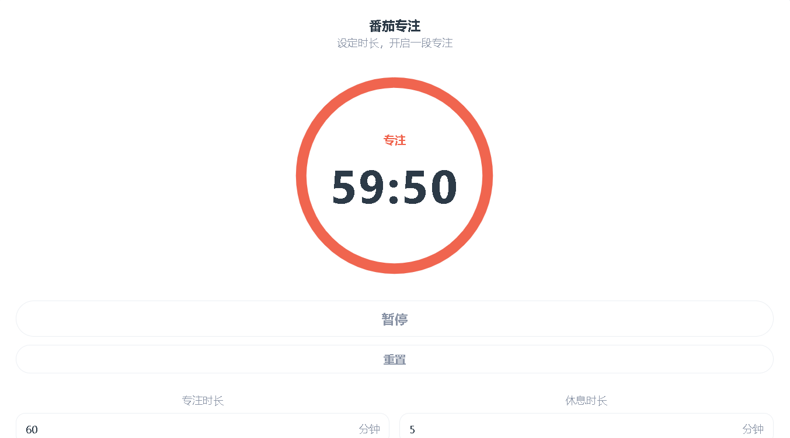
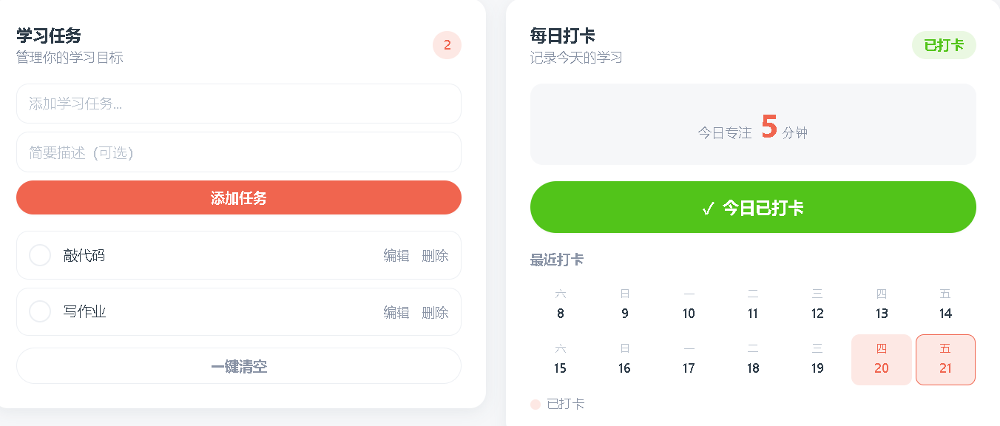
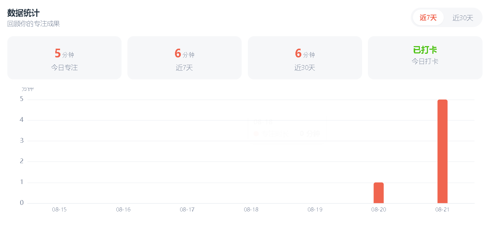

# Focusly 番茄时钟 · 专注学习打卡工具

轻量化单页 Web 应用，集 **番茄专注计时、学习任务管理、每日学习打卡、学习数据可视化统计** 于一体。
## 自评一句话
关于各功能的实现最完善，对各功能都进行了多方测试，如对番茄钟进行长时间运行、非法时间输入等测试。



## 技术栈

- Vue 3（Composition API）
- Vite
- Axios（封装通用请求类）
- ECharts（数据可视化）
- LocalStorage（离线兜底 / 本地持久化）
- Mock API（Apifox 模拟后端）

## 快速开始

```bash
npm install
npm run dev
```

浏览器打开 `http://localhost:5173`。

## 环境模式

`.env` 中的 `VITE_API_BASE_URL` 决定数据来源：

| 模式 | VITE_API_BASE_URL | 说明 |
|---|---|---|
| 本地模式（默认） | 留空 | 完全使用 LocalStorage，数据不丢 |
| Mock 演示模式 | Apifox Mock 地址 | 模拟标准 RESTful 交互 + 异常降级兜底 |

## 目录结构

```
src/
├── assets/        # 全局样式与静态资源
├── components/    # 组件（common/timer/task/clock/chart）
├── views/         # 页面级视图
├── composables/   # 领域逻辑 + 共享状态单例
├── services/      # 数据访问层（axios 封装 + 接口 + Mock 适配）
├── utils/         # 纯函数工具（storage/date/format/validators）
├── stores/        # 状态管理说明（本阶段使用 composable 单例，见目录内 README）
├── constants/     # 全局常量（存储 key、默认值、枚举）
└── router/        # 路由
```

## 架构约定

- **LocalStorage 是真相源，Mock 是优先尝试的通道**，远端静态数据不反向覆盖本地。
- 计时器采用「时间戳差值法」避免漂移（详见 Phase 3 实现）。
- 共享状态由 `composables/` 的 module 级 reactive 单例承担，暂未引入 Pinia。
